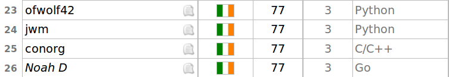

I've been posting a fair bit about Project Euler recently, because I've been doing quite a lot of it. But now it feels like it's been worth it; yesterday morning I achieved my Project Euler target of catching up to Conor Griffin & being the (joint) highest CPSSD on the charts. I think we're also the highest DCU students there.

I'm in joint 23rd in the Irish rankings, with 77 problems solved. The chart only takes into account people who have solved a problem in the past year, but I don't think it's unreasonable to assume that the people at the top of the table with more problems solved are the ones who solve more often. There may be a few people around the top 20 that don't appear in the list, but I'd say it's a fairly small number.

I'm delighted. My [Github](http://github.com/iandioch) looks much more active with my daily commits of my solutions, my Go has really improved, and I've learned a few things along the way about maths and programming.

I look forward to solving more problems and climbing a little higher in the rankings. Only 50-odd problems to go until the top 10!

Ádh mór leat,

Noah