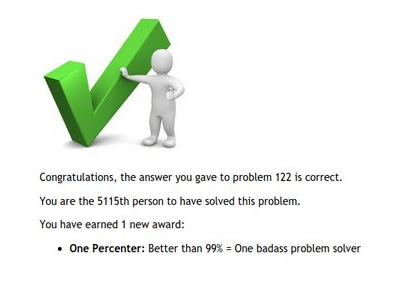
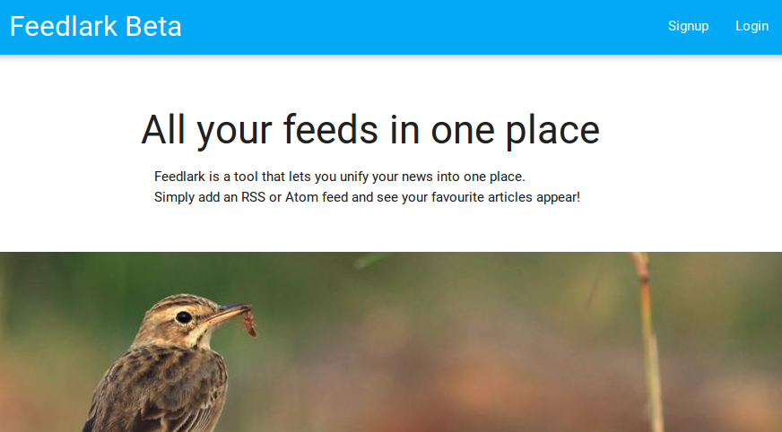
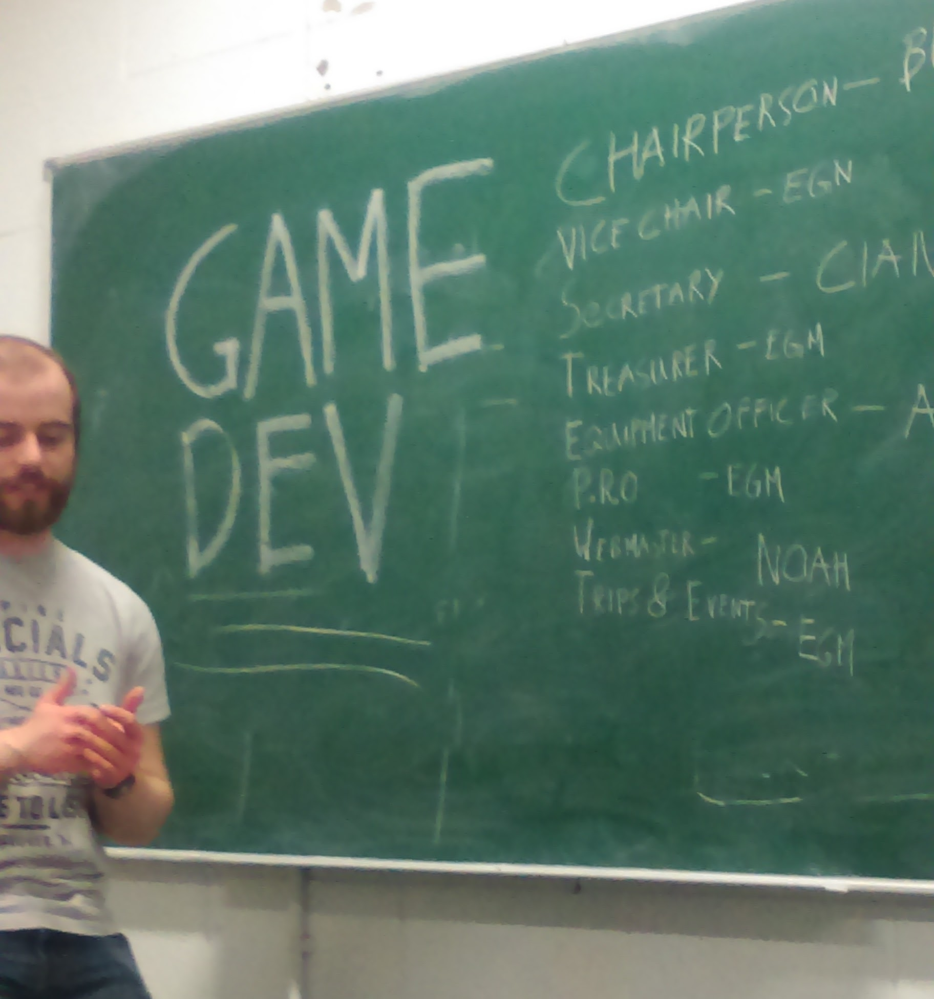
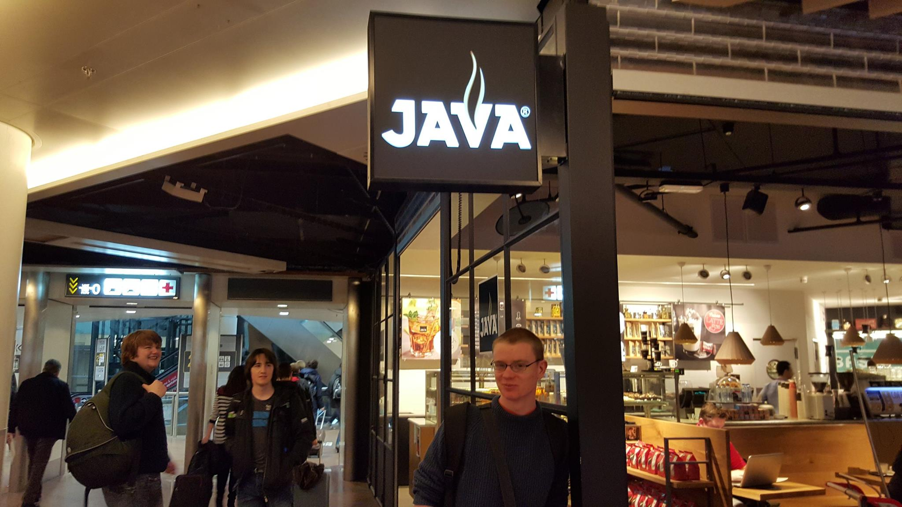

A warm breeze was blowing the day before yesterday. The sun shone with a bit of hope, and young cheerful students poured out of their dark corners and started playing frisbee on the DCU green and pretending to have fun. Summer must have arrived.

My exams in a week's time are the only thing standing between me and being finished the first year of my degree. It's been a crazily busy year; this blog post will be an attempt to wrap it all up. I was pipped to the post in writing an end-of-year article by [Cian Ruane](http://binarysear.ch), but mine will be different. While he offered advice to the future years of hopefuls, I can't even give myself advice.

Here's a rundown of what's been happening lately. Each item should probably be its own article, but I'm too much of a [slacker](http://subgenius.com) for that.

</img>

- Just a few minutes ago, I finished my 118th Project Euler problem. In the grand scheme of things. that's nothing - it's the ones that are left that are difficult. However, it puts me in 12th place on the [Irish leaderboard](http://projecteuler.net/country=Ireland) (you need to be signed in to see that), in the top 10 go users (although I've been doing a lot of Python lately), and in the top 1% of users worldwide. It's been great fun giving it a go, and I'm suprised I have managed to keep going like I have. I've learned a huge amount about exciting parts of maths, and it has really given me a push to start exploring maths in my own time...
- I finished reading some books! [*'Innocent Code: A Security Wake-Up Call for Web Programmers'* by Sverre Huseby](http://innocentcode.thathost.com), while not introducing me to any new ideas per se, firmed up my general knowledge on infosec, and just made it something that I will think about in future. I don't know if I would recommend the book to everybody, but it definitely helped me. Much more importantly, *'Fermat's Last Theorem'* by Simon Singh was a huge influence on me, and should be required reading for all Leaving Certs. It filled in the gaps in my maths education, taught me some of the history of maths, put all of the famous mathematics names in context, and showed me how much of a passion maths can create in a person. It was a fantastic book.
- I'm in the middle of reading *'Programming Pearls'* by Jon Bentley, *'Code Complete'* by Steve McConnell, *'Functional Programming Through Lambda Calculus'* by Greg Michaelson, and *'Introduction to Analytic Number Theory'* by Tom M. Apostol. All are expanding my head in different ways, and making me even more excited to read more. Some of the concepts in these books are very far above my head, but that just makes them more interesting. It's great to have some free time now that lectures and projects are finished to explore the things I've wanted to explore for a while. 

</img>

- Speaking of projects, our official time with [Feedlark](http://feedlark.com) is finished. I don't think I've mentioned it on my blog before, but it was our project for this semester. It is a web-based RSS aggregator, that uses machine learning to put together a model for each user, and prioritises articles they are likely to be interested in. In short, it ruins RSS for so many people. However, I don't have time to pore over my RSS stream, and with a bit more polishing of the Feedlark algorithm, it will let me see all the content I want and leave out the bits I'm not interested in. It's not a product for everybody, but it's a product for me. Hopefully, it will be open-sourced at some point in the future, but it's not our call, it's up to the lecturererererers. In any case, over the course of the project, I've learned a huge amount about software planning, project management, and teamwork - things that I could not have learned had I not been in university, and probably things that I couldn't have learned to the same extent had I not been in this course.
- I was recently elected [Chair](http://reddit.com/r/chairs) of [Redbrick](http://redbrick.dcu.ie), DCU's Networking Society. I was Secretary this year, and it was very fun. While networking may not be my forte, I look forward to learning some more about it, doing some more things with some cool people, and all the while steering the society into a whirlpool of poor organisation and existential doubt. Yay! Three cheers for Redbrick!

</img>

- I'm the new webmaster of DCU's Game Development Society. It's therefore my fault that the society doesn't have a domain to link to here.
- Earlier this semester I attended the Union of Students in Ireland's annual national congress. I was expecting to be just an observer, but because of numbers I was bumped up to be a full DCU delegate, with a vote on such matters as the Union's stance on abortion, and even on the structure of the USI istelf. It was a very eye-opening experience, and one which will (eventually) get a full blog post to itself, before I forget everything about it.
- I raised €320 for Childline through [100minds](https://www.100minds.org/2016/313/noah-donnelly), by giving programming grinds, and [organising a programming competition](http://computing.dcu.ie/news/childline-charity-programming-competition) here in DCU. It's not near the €1000 that was my target, but considering how busy I was this semester, I'm very proud of how much I achieved. I couldn't have done the competition without the help of Gary Conway, the organiser of the All-Ireland Programming Olympiad and a sysadmin in the DCU computing faculty, who set up the competition system, gave me tips, and (with the wonderful Christine Stears) convinced Spar DCU that my competition was worth sponsoring <3
- I helped out at [ComputeTY](http://www.computing.dcu.ie/event/computety), teaching young wans in Transition Year how to do some basic Java. I love Java, however, many of them didn't have the same passion for it. It was interesting and humbling to see them learn to code, considering that it wasn't that long ago that I was in the same boat. I was reminded how I quite like teaching, but moreso how much more satisfying it is just programming on my own in a dark room, with a beer...
- Before I get chair-ing and scaring with Redbrick and GameDevSoc, I am going to be spending the summer working as a Google STEP intern in sunny sunny Zurich. I can't wait. I'm not sure yet if I'm more excited to be working for the big GOOG, or to be in Zurich, but the fact I get both has left me over the moon. I'm itching to get going. What's more, I have a free month before I start work, which I plan on spending travelling. I won't post details before I buy my ticket, because they'll be in flux until then. That's less than 30 days away, however - I'd better get my skates on.
- In other news, team `cat /dev/urandom >> solution.cpp` came 2nd in the university section of this year's [IrlCPC](http://acm.ucc.ie/irlcpc), which means that myself and my two teammates Cian and Stefan each won a shiny new Chromebook (which I will probably blog about at some stage), a cool plaque (which I'm 90% sure I've misplaced), and a copy of *'The Go Programming Language'* by Alan Donovan and Brian Kernighan (which I may have read already). This was the best I've ever done at a big programming competition, the best prizes I've ever won in anything, and the ultimate shame, as the secondary school dream team of AIPO competitors got 2 points more than us. Boooo.
- I also competed in the Openet De/Coding Event, in which I received a runner-up prize for completing all of the problems bar one, and doing so in an interesting way (using some of my beloved linked lists to solve their problems). For my troubles, I won a cool green Razer Naga gaming mouse. While I do almost all of my computing by the keyboard only (due to the fact that the only programs I use are Firefox, with VimFX for keyboard controls, and Vim itself), it looks great on my desk, and has an impressive 12 buttons for me to accidentally press when I try to pause a Youtube video. Really though, it's a very cool prize, and I'm very thankful for it. Once I get the rest of a proper gaming PC together, it will fit in perfectly.

</img>

In general, I've learned an immeasurable amount this year, and particularly this semester, both about the art of computerbreaking, and just generally being me. More importantly, it's shown me just how much I don't know about either. I've tried this year to take on board some advice I've found around the internet (mostly from late night lurks on Quora). I've started doing some weird things, like brushing my teeth with my left hand to improve my ambidexterity, but also some really genuinely useful things, like keeping a Trello board with all of my to-do list (which will be a topic of a future blog post, no doubt). I made an effort to keep a journal for a while, and figured out that it just wasn't for me (although I will probably try it again in the future). I've started a policy of trying out anything that is recommended to me three times, be it a particular book (Pólya's *'How to Solve It'* is on my watchlist now), or a certain habit (like those few mentioned above). I've also started thinking about things like metacognition, which, while covered in last semester's lectures by John McKenna, isn't something most of those around me take all that seriously. Oh well! It seems like it's worth trying at.

This semester I've figured out, to some extent, who I want to be; now it's just a case of getting there. I think that the getting there is probably the hard part.

I'm also finally starting to accept the fact that I take myself *way* too seriously sometimes.

Oh well.

Nos da,

Noah xoxo

